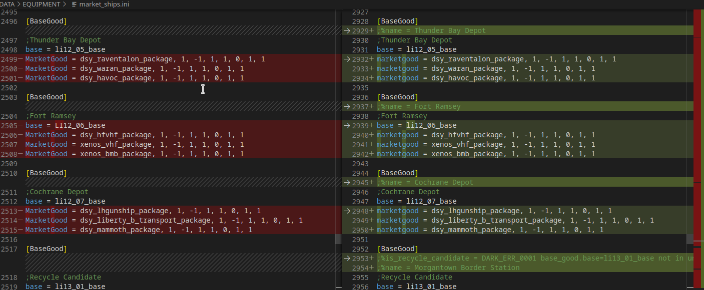

# Darktool

## Description

- Set of dev tools for Freelancer Discovery community, in order to help them in their effort
- Main goal is to create classic linter for game files, whichi can autofix config files
- For tool usage was developed freelancer ini reader/writer with easily mapping variables to access in ORM - object relational mapping fashion. This alone allows quickly accessing any config data with least amont of code effort for additional features.

## Features:

- Processes
  - `market_commodities.ini`
  - `market_misc.ini`
  - `market_ships.ini`
  - `universe_ini`
  - all system files like `universe/systems/**/br01.ini`
- For processed files brings to lower case allowed set of keys, like `base = GA06_03_base` to `base = ga06_03_base`
- to `market_*.ini` files it adds to bases human readable name extracted from infocard.txt
- to `market_*.ini` reports if base is recycle_candidate, by checking missmatch in its set system and pressence in files + if system is `fp7` or `ga13`, example:
  - `;%is_recycle_candidate = DARK_ERR_0001 base_good.base=ga06_03_base not in universe.ini->Base.system->System.file->systems\ga13\ga13.ini | universe.ini->Base.system=ga13 in [[ga13 fp7]]`
  - see picture example below
- rounds all float numbers to have one digit after dot at maximum. `45.7465645656` to `45.7`

## Future development

The tool is intended to add additional features in linting configurational files.
It is possible adding any other additional rules for checking foreign key data integrity between objects
Or adding additional commented strings to objects with helpful information

Request new features [here](https://github.com/darklab8/darklab_freelancer_darktool/issues)

## Downloads

[download here](https://github.com/darklab8/darklab_freelancer_darktool/releases)

currently built for:

- linux amd64
- windows amd64

## How to use

- copy executable file to root folder of freelancer
- run `{{executable}} validate`
- check help info in `{{executable}} --help`
- check additional flag to command with `{{executable}} validate --help`

## Dev Requirements

- cobra generator https://github.com/spf13/cobra-cli/blob/main/README.md
- cobra guide https://github.com/spf13/cobra/blob/main/user_guide.md
- godoc
- add binary discovery for cobra-cli, godoc detection
  - `export PATH="$PATH:/usr/local/go/bin:$HOME/go/bin"`
- Git hooks of conventional commits
  - [docs](https://gist.github.com/qoomon/5dfcdf8eec66a051ecd85625518cfd13)
  - [app](https://www.npmjs.com/package/git-conventional-commits)

## Contributors

- [@dd84ai](https://github.com/dd84ai) // coding
- [@Groshyr](https://github.com/Groshyr) // spark of inspiration for project birth + beta tester + feature requester + domain expert
