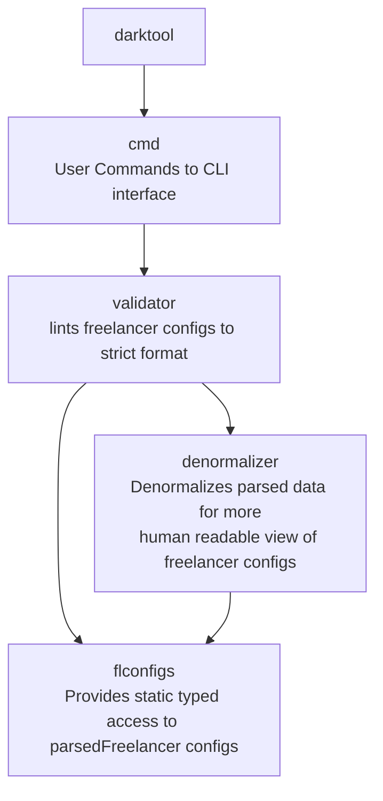

# fl-darklint

## Description

- Main goal of the tool is to be classic linter for game files, whichi can autofix config files
  - inspired by `python black` linter that formats everything to same uniform standard
  - `formatter` module is responsible for this
- Additionally it is capable to supply human readable comments to config objects for easier life.
  - `denormalizer` module is responsible for this
- For tool usage was developed freelancer ini reader/writer with easily mapping variables to access in ORM - object relational mapping fashion. This alone allows quickly accessing any config data with least amont of code effort for additional features.
  - (see fl-configs library in a separate repo)

## Features:

- Processes
  - `market_commodities.ini`
  - `market_misc.ini`
  - `market_ships.ini`
  - `universe_ini`
  - all system files like `universe/systems/**/br01.ini`
- For processed files brings to lower case allowed set of keys, like `base = GA06_03_base` to `base = ga06_03_base`
- to `market_*.ini` files it adds to bases human readable name extracted from infocard.txt
- to `market_*.ini` reports if base is recycle_candidate, by checking missmatch in its set system and pressence in files + if system is `fp7` or `ga13`, example:
  - `;%is_recycle_candidate = DARK_ERR_0001 base_good.base=ga06_03_base not in universe.ini->Base.system->System.file->systems\ga13\ga13.ini | universe.ini->Base.system=ga13 in [[ga13 fp7]]`
  - see picture example below
- rounding float numbers for set keys to more preferable precision. `45.7465645656` to `45.7`

## Future development

The tool is intended to add additional features in linting configurational files.
It is possible adding any other additional rules for checking foreign key data integrity between objects
Or adding additional commented strings to objects with helpful information

Request new features [here](https://github.com/darklab8/fl-darklint/issues) or there [Darklab Discord server](https://discord.gg/aukHmTK82J)

## Usage with installation
### At linux

- install curl if not installed.(`apt update && apt install -y curl` for debian/ubuntu)
- install git if not present (`apt update && apt install -y git` for debian/ubuntu)
- install darklint with `sudo rm $(which darklint) ; sudo curl -L $(curl -Ls -o /dev/null -w %{url_effective} https://github.com/darklab8/fl-darklint/releases/latest | sudo sed "s/releases\/tag/releases\/download/")/darklint-linux-amd64 -o /usr/local/bin/darklint && sudo chmod 777 /usr/local/bin/darklint`
- check installation with `darklint version` command. Expect to see `OK darklint version: v{version}`

### install specific version

- install with `rm $(which darklint) ; curl -L https://github.com/darklab8/darklint/releases/download/v{VERSION}/darklint-linux-amd64 -o /usr/local/bin/darklint && chmod 777 /usr/local/bin/darklint`

### At Windows

- install [Git Bash](https://git-scm.com/downloads)
- install darklint `mkdir -p ~/bin ; rm $(which darklint) ; curl -L $(curl -Ls -o /dev/null -w %{url_effective} https://github.com/darklab8/fl-darklint/releases/latest | sed "s/releases\/tag/releases\/download/")/darklint-windows-amd64.exe -o ~/bin/darklint.exe && chmod 777 ~/bin/darklint.exe`
- check installation with `darklint version` command. Expect to see `OK darklint version: v{version}`

P.S. `~/bin/darklint.exe` must be any valid bin path (`echo $PATH`, `echo %PATH%` to get the list) accessable by your tool from where u are going to use it.

## after installation

- go to Freelancer folder root and apply with `darklint format`

## Simplified usage:

- just [download here](https://github.com/darklab8/fl-darklint/releases)
- copy executable file to root folder of freelancer
- run `{{executable}} format`
- check help info in `{{executable}} --help`
- check additional flag to command with `{{executable}} format --help`

## Dev Requirements

- cobra generator https://github.com/spf13/cobra-cli/blob/main/README.md
- cobra guide https://github.com/spf13/cobra/blob/main/user_guide.md
- godoc
- add binary discovery for cobra-cli, godoc detection
  - `export PATH="$PATH:/usr/local/go/bin:$HOME/go/bin"`
- Git hooks of conventional commits
  - [docs](https://gist.github.com/qoomon/5dfcdf8eec66a051ecd85625518cfd13)
  - [app](https://www.npmjs.com/package/git-conventional-commits)

## Architecture

## Contributors

- [@dd84ai](https://github.com/dd84ai) // coding
- [@Groshyr](https://github.com/Groshyr) // spark of inspiration for project birth + beta tester + feature requester + domain expert
